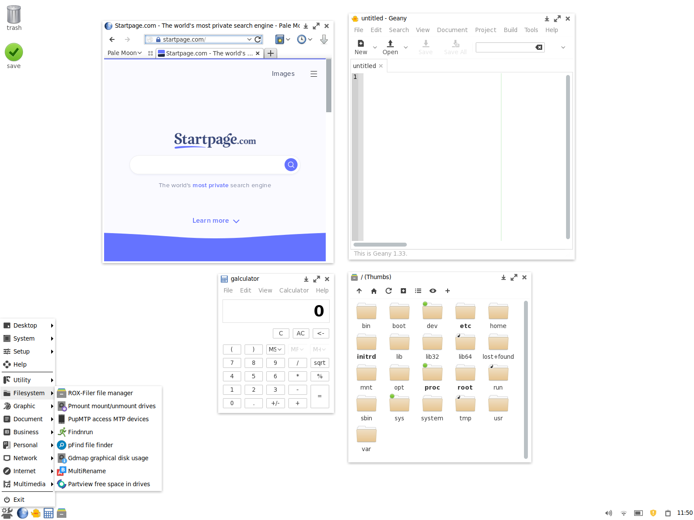
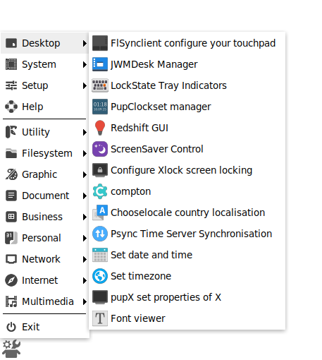
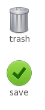
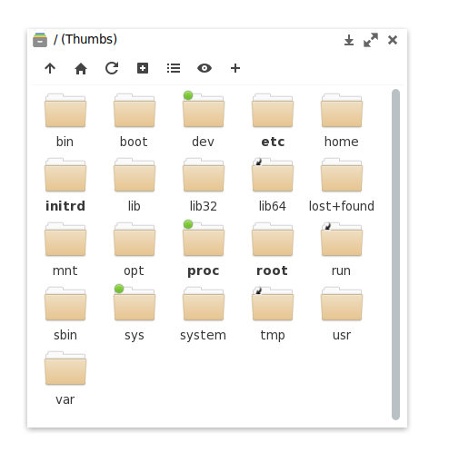
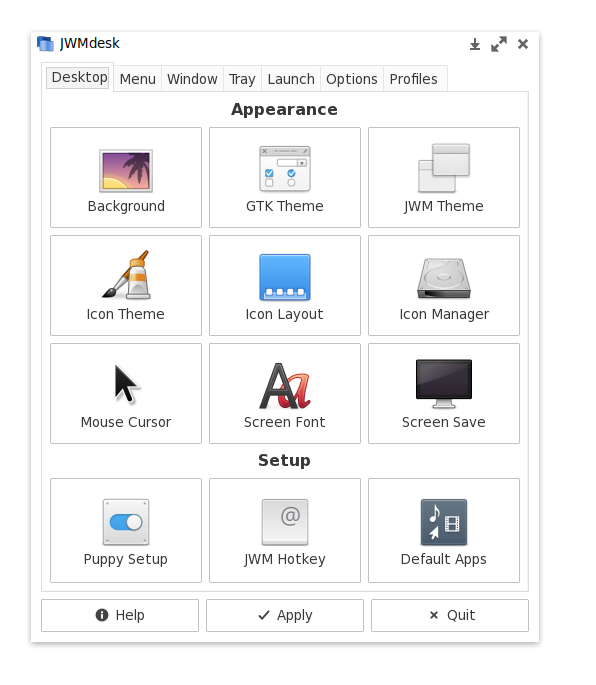
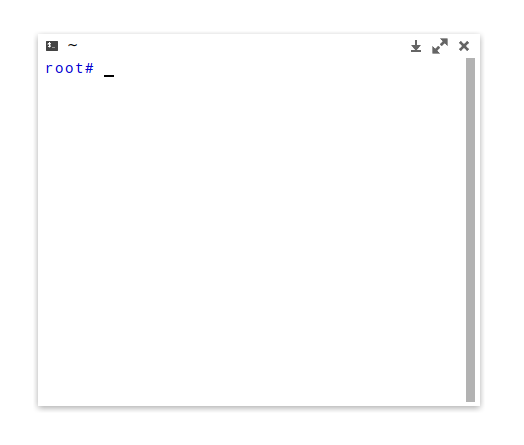

# JESOS
 The Puppy of Light

## Origins
JESOS is based on BionicPup64 8.0, which means that it is built from and compatible with Ubuntu 18.04 LTS packages.

JESOS is in it's early stages, so there is still a lot of BionicPup artwork in the mix.

## Customizations
- New icon theme (based on [elementary](https://github.com/elementary/icons) and [papirus](https://github.com/PapirusDevelopmentTeam/papirus-icon-theme))
- New JWM window buttons (from [elementary](https://github.com/elementary/icons))
- New default JWM tray layout
- Lighter GTK theme
- Less preinstalled applications

## Goals
JESOS wants to be a light, stylish and friendly Linux distro.

- Light: Keep every footprint as small as possible.
- Stylish: The user should never have to frown at their computer. Everything should be beautiful and clear.
- Friendly: Give the user a sane default configuration.

## Screenshots

## Download
JESOS is pre-alpha and is used at your own risk. The ISO is found here in the repo.

## Install
JESOS lives on a USB-stick. To install it you flash the ISO to an empty stick using [Etcher](https://www.balena.io/etcher/) or [dd](https://linuxhint.com/dd_command_linux/).
